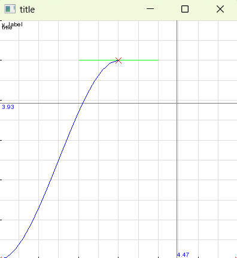

# Muzkaw
This is a collection of code shared alongside Muzkaws' YouTube videos [2].

Currently only tested on Windows.

## Code
### ElectroStat


https://www.youtube.com/watch?v=9A6YtB1pNrk  
https://www.youtube.com/watch?v=F2JoxwAOBV0  

### FFT2


https://www.youtube.com/watch?v=LqUuMqfW1PE  

### Graph


### ParticlePursuers


https://www.youtube.com/watch?v=OoZv0yLRQWc  

## Setup
### vcpkg [3]
Install dependencies (for example on Windows 64-bit)
```
vcpkg install sfml:x64-windows
```

When calling CMake, set the CMake toolchain file to vcpkg
```
-DCMAKE_TOOLCHAIN_FILE=[path to vcpkg]/scripts/buildsystems/vcpkg.cmake
```

## Development
### Formatting
```
.\scripts\clang-format-all.ps1 -RepoRoot . -Include '*.h', '*.cpp'
```

## Changes
- Convert projects to CMake
- Minor changes to make the projects compile
- Remove `using namespace ...`
- Flatten hierarchy
- Remove Visual Studio specific files

## Links
[1] [Muzkaw - Github](https://github.com/Muzkaw)  
[2] [Muzkaw - YouTube](https://www.youtube.com/@Muzkaw/)  
[3] [vcpkg - Github](https://github.com/microsoft/vcpkg)
